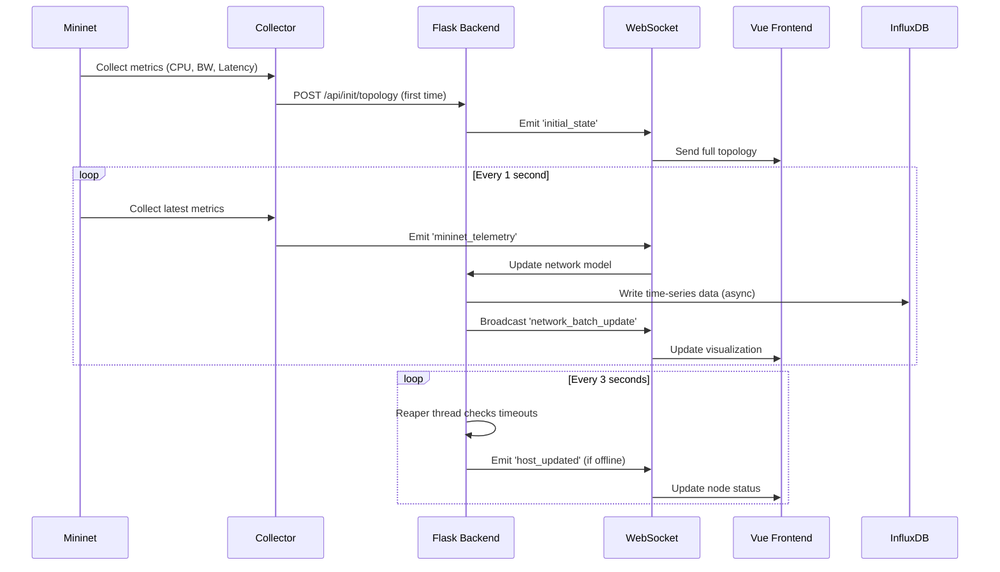

# 🌐 Digital Twin Network Dashboard

<div align="center">


**Real-time Digital Twin for Network Infrastructure Monitoring and Simulation**

[](https://www.python.org/)
[](https://vuejs.org/)
[](https://flask.palletsprojects.com/)
[](http://mininet.org/)
[](LICENSE)

[Features](#-features) • [Architecture](#-architecture) • [Installation](#-installation) • [Usage](#-usage) • [Documentation](#-documentation) • [Contributing](#-contributing)

</div>

---

## 📑 Table of Contents

- [Overview](#-overview)
- [Key Features](#-key-features)
- [System Architecture](#-system-architecture)
- [Technology Stack](#-technology-stack)
- [Prerequisites](#-prerequisites)
- [Installation](#-installation)
- [Quick Start](#-quick-start)
- [Configuration](#-configuration)
- [API Documentation](#-api-documentation)
- [Troubleshooting](#-troubleshooting)
- [Performance Optimization](#-performance-optimization)
- [Security Considerations](#-security-considerations)
- [Development Roadmap](#-development-roadmap)
- [Contributing](#-contributing)
- [License](#-license)
- [Acknowledgments](#-acknowledgments)

---

## 🎯 Overview

**Digital Twin Network Dashboard** is a comprehensive real-time monitoring and simulation platform that creates a virtual replica of physical network infrastructure. Built with modern web technologies and network emulation tools, it enables network engineers, researchers, and students to visualize, analyze, and optimize network performance in a safe, controlled environment.

### What is a Digital Twin?

A Digital Twin is a virtual representation of a physical system that mirrors its state, behavior, and performance in real-time. In the context of networking, our Digital Twin:

- **Synchronizes** with physical/simulated network infrastructure continuously
- **Mirrors** device states, metrics, and topology changes instantly
- **Predicts** potential issues through historical data analysis
- **Enables** "what-if" scenarios without affecting production networks

### Use Cases

| Sector | Application |
|--------|-------------|
| 🎓 **Education** | Network engineering training, protocol learning, hands-on labs |
| 🔬 **Research** | SDN/NFV testing, new protocol validation, performance benchmarking |
| 🏢 **Enterprise** | Network planning, capacity analysis, infrastructure design |
| 🛡️ **Security** | Attack simulation, defense testing, incident response training |
| 🏗️ **DevOps** | CI/CD pipeline testing, infrastructure as code validation |

---

## ✨ Key Features

### 🎯 Core Capabilities

#### Real-Time Monitoring
- **Device Metrics**: CPU utilization, memory usage, network throughput
- **Link Performance**: Bandwidth usage, latency, jitter, packet loss
- **Switch Statistics**: Port-level traffic, dropped packets, errors
- **Path Analysis**: End-to-end latency between any two hosts

#### Interactive Visualization
- **Dynamic Topology Graph**: Drag-and-drop, zoom, pan, physics simulation
- **Color-Coded Status**: Visual indicators for device health (up/offline/high-load/warning)
- **Animated Traffic Flow**: Real-time bandwidth visualization on links
- **Click-to-Inspect**: Detailed device/link information on selection

#### Advanced Features
- **WebSocket Communication**: Sub-second update latency
- **Thread-Safe Operations**: Concurrent metric collection without race conditions
- **Automatic Failover**: Device timeout detection and recovery
- **Historical Data Storage**: Time-series database (InfluxDB) integration
- **Grafana Dashboards**: Customizable charts and alerts

### 📊 Metrics Collected

| Category | Metrics | Update Interval |
|----------|---------|----------------|
| **Host** | CPU (%), Memory (%), RX/TX Bytes | 1 second |
| **Link** | Throughput (Mbps), Utilization (%), Latency (ms) | 1 second |
| **Path** | Round-Trip Time (ms), Packet Loss (%), Jitter (ms) | Random sampling |
| **Switch** | Port RX/TX Packets, Dropped, Errors | 5 seconds |

### 🎨 Visual Status Indicators

```
🟢 Green  → Device UP, normal load (<70% utilization)
🟡 Yellow → High load warning (70-90% utilization)
🔴 Red    → Critical load (>90% utilization)
⚫ Gray   → Device OFFLINE (no heartbeat for 6+ seconds)
```

---

## 🏗️ System Architecture

### High-Level Overview

```
┌────────────────────────────────────────────────────────────────┐
│                      PHYSICAL LAYER                            │
│  ┌──────────────────────────────────────────────────────┐     │
│  │           Mininet Network Emulator                    │     │
│  │  ┌─────────┐  ┌─────────┐  ┌─────────┐             │     │
│  │  │  Host   │  │  Host   │  │  Host   │  (Virtual)   │     │
│  │  │   h1    │──│   h2    │──│   h3    │             │     │
│  │  └─────────┘  └─────────┘  └─────────┘             │     │
│  │       │            │            │                    │     │
│  │  ┌────┴────────────┴────────────┴────┐              │     │
│  │  │     OpenFlow Switch (OVS)         │              │     │
│  │  │            s1                      │              │     │
│  │  └────────────────────────────────────┘              │     │
│  │                                                       │     │
│  │  Traffic Generation: iPerf UDP streams               │     │
│  │  Metrics Collection: vmstat, free, /proc/net/dev     │     │
│  └──────────────────┬────────────────────────────────────┘     │
└────────────────────┼───────────────────────────────────────────┘
                     │
                     │ HTTP POST + WebSocket
                     │ (JSON Telemetry Batches)
                     ▼
┌────────────────────────────────────────────────────────────────┐
│                   DIGITAL TWIN LAYER                           │
│  ┌──────────────────────────────────────────────────────┐     │
│  │              Flask Backend (Python)                   │     │
│  │  ┌─────────────────────────────────────────────┐     │     │
│  │  │  Network Model (In-Memory State)            │     │     │
│  │  │  ┌──────────┐  ┌──────────┐  ┌──────────┐  │     │     │
│  │  │  │   Host   │  │  Switch  │  │   Link   │  │     │     │
│  │  │  │  Objects │  │  Objects │  │  Objects │  │     │     │
│  │  │  └──────────┘  └──────────┘  └──────────┘  │     │     │
│  │  │  • CPU/Memory state   • Port stats          │     │     │
│  │  │  • Status tracking    • Flow tables         │     │     │
│  │  │  • Timestamp          • Heartbeat           │     │     │
│  │  └─────────────────────────────────────────────┘     │     │
│  │                                                       │     │
│  │  ┌─────────────────────────────────────────────┐     │     │
│  │  │  Socket.IO WebSocket Server                 │     │     │
│  │  │  Events: mininet_telemetry, initial_state   │     │     │
│  │  │  Broadcasts: host_updated, link_updated     │     │     │
│  │  └─────────────────────────────────────────────┘     │     │
│  │                                                       │     │
│  │  ┌─────────────────────────────────────────────┐     │     │
│  │  │  REST API (Flask Blueprints)                │     │     │
│  │  │  POST /api/init/topology                    │     │     │
│  │  │  GET  /api/network/status                   │     │     │
│  │  │  GET  /api/health                           │     │     │
│  │  └─────────────────────────────────────────────┘     │     │
│  │                                                       │     │
│  │  ┌─────────────────────────────────────────────┐     │     │
│  │  │  Background Services                        │     │     │
│  │  │  • Reaper Thread (timeout detection)       │     │     │
│  │  │  • InfluxDB Writer (time-series storage)   │     │     │
│  │  └─────────────────────────────────────────────┘     │     │
│  └──────────────────────────────────────────────────────┘     │
└────────────────┬──────────────────────┬────────────────────────┘
                 │                      │
          WebSocket (Real-time)    HTTP (Time-series)
                 │                      │
                 ▼                      ▼
┌─────────────────────────────┐  ┌─────────────────────────┐
│   VISUALIZATION LAYER       │  │    STORAGE LAYER        │
│  ┌───────────────────────┐  │  │  ┌───────────────────┐  │
│  │  Vue.js 3 Frontend    │  │  │  │  InfluxDB 2.7     │  │
│  │  ┌─────────────────┐  │  │  │  │  • host_metrics   │  │
│  │  │  TopologyView   │  │  │  │  │  • link_metrics   │  │
│  │  │  (vis-network)  │  │  │  │  │  • path_metrics   │  │
│  │  └─────────────────┘  │  │  │  │  • 7-day retention│  │
│  │  ┌─────────────────┐  │  │  │  └───────────────────┘  │
│  │  │   InfoPanel     │  │  │  │                         │
│  │  │  (Device Stats) │  │  │  │  ┌───────────────────┐  │
│  │  └─────────────────┘  │  │  │  │  Grafana          │  │
│  │  ┌─────────────────┐  │  │  │  │  • Dashboards     │  │
│  │  │    Header       │  │  │  │  │  • Alerts         │  │
│  │  │  (Timestamp)    │  │  │  │  │  • Annotations    │  │
│  │  └─────────────────┘  │  │  │  └───────────────────┘  │
│  └───────────────────────┘  │  └─────────────────────────┘
│  • Vite 7 Dev Server       │  • Docker Compose           │
│  • Hot Module Reload       │  • Volume Persistence       │
└─────────────────────────────┘  └─────────────────────────┘
```

### Data Flow Diagram

```
┌─────────┐  1. Metrics   ┌─────────────┐  2. HTTP POST   ┌─────────┐
│ Mininet │──Collection──→│   Mininet   │───────────────→│  Flask  │
│ Hosts   │               │   Collector │                 │ Backend │
└─────────┘               └─────────────┘                 └────┬────┘
                                                                │
                          ┌─────────────────────────────────────┘
                          │
                          │ 3. Update Digital Twin Model
                          │    (Thread-safe with Lock)
                          ▼
                    ┌──────────────┐
                    │ Network Model│
                    │  • Hosts     │
                    │  • Switches  │
                    │  • Links     │
                    └──────┬───────┘
                           │
                           │ 4. Broadcast via WebSocket
                           ▼
                    ┌──────────────┐     5. Real-time     ┌──────────┐
                    │  Socket.IO   │─────Render Updates──→│  Vue.js  │
                    │    Server    │                       │ Frontend │
                    └──────────────┘                       └──────────┘
                           │
                           │ 6. Persist to InfluxDB
                           ▼
                    ┌──────────────┐
                    │   InfluxDB   │
                    │ (Time-series)│
                    └──────────────┘
```

### Component Interaction Flow



---

## 🛠️ Technology Stack

### Backend

| Technology | Version | Purpose |
|------------|---------|---------|
| **Python** | 3.8+ | Core runtime |
| **Flask** | 3.1.6 | Web framework |
| **Flask-SocketIO** | 5.14+ | WebSocket server |
| **Flask-CORS** | Latest | Cross-origin support |
| **eventlet** | Latest | Async I/O (monkey patching) |
| **requests** | Latest | HTTP client |
| **python-socketio** | 5.14+ | WebSocket client |
| **influxdb-client** | Latest | Time-series DB client |

### Frontend

| Technology | Version | Purpose |
|------------|---------|---------|
| **Vue.js** | 3.5.22 | UI framework |
| **Vite** | 7.1.11 | Build tool |
| **vis-network** | 10.0.2 | Network graph visualization |
| **axios** | 1.13.2 | HTTP client |
| **socket.io-client** | 4.8.1 | WebSocket client |

### Network Simulation

| Technology | Version | Purpose |
|------------|---------|---------|
| **Mininet** | 2.3+ | Network emulator |
| **Open vSwitch** | 2.17+ | Virtual switch |
| **iPerf** | 2.x | Traffic generation |

### Monitoring & Storage

| Technology | Version | Purpose |
|------------|---------|---------|
| **InfluxDB** | 2.7 | Time-series database |
| **Grafana** | Latest | Visualization & alerting |
| **Docker** | 20+ | Containerization |
| **Docker Compose** | 2+ | Multi-container orchestration |

---

## 📋 Prerequisites

### System Requirements

#### Minimum Configuration
- **OS**: Ubuntu 20.04 LTS or later
- **CPU**: 2 cores (x86_64)
- **RAM**: 4 GB
- **Disk**: 10 GB free space
- **Network**: 100 Mbps

#### Recommended Configuration
- **OS**: Ubuntu 22.04 LTS
- **CPU**: 4+ cores
- **RAM**: 8+ GB
- **Disk**: 20+ GB SSD
- **Network**: 1 Gbps

### Software Prerequisites

```bash
# Check Python version (3.8+)
python3 --version

# Check Node.js version (20+)
node --version
npm --version

# Check Docker installation
docker --version
docker-compose --version

# Check Mininet installation
mn --version
```

### Installation of Prerequisites

#### 1. Python 3.8+
```bash
sudo apt update
sudo apt install -y python3 python3-pip python3-venv
```

#### 2. Node.js 20+
```bash
# Using NodeSource repository
curl -fsSL https://deb.nodesource.com/setup_20.x | sudo -E bash -
sudo apt install -y nodejs

# Verify installation
node --version  # Should be v20.x.x or higher
npm --version
```

#### 3. Mininet
```bash
# Install from Ubuntu repository
sudo apt install -y mininet

# OR install from source for latest version
git clone https://github.com/mininet/mininet
cd mininet
git checkout 2.3.0
sudo PYTHON=python3 ./util/install.sh -a

# Verify installation
sudo mn --version
sudo mn --test pingall
```

#### 4. Docker & Docker Compose
```bash
# Install Docker
sudo apt install -y docker.io
sudo systemctl start docker
sudo systemctl enable docker

# Add user to docker group (optional, to run without sudo)
sudo usermod -aG docker $USER
newgrp docker

# Install Docker Compose
sudo apt install -y docker-compose

# Verify installation
docker --version
docker-compose --version
```

---

## 🚀 Installation

### Step 1: Clone Repository

```bash
git clone https://github.com/vantai13/DigitalTwinProject.git
cd DigitalTwinProject
```

### Step 2: Backend Setup

```bash
# Create Python virtual environment
python3 -m venv venv

# Activate virtual environment
source venv/bin/activate

# Upgrade pip
pip install --upgrade pip

# Install Python dependencies
pip install -r requirements.txt

# Verify installation
pip list | grep Flask
pip list | grep socketio
```

**Important**: Do NOT activate `venv` when running Mininet (Step 4). Mininet requires system Python.

### Step 3: Frontend Setup

```bash
cd frontend

# Install Node.js dependencies
npm install

# Verify installation
npm list vue
npm list vis-network

# Return to project root
cd ..
```

### Step 4: Monitoring Stack Setup

```bash
# Start InfluxDB and Grafana containers
docker-compose up -d

# Verify containers are running
docker-compose ps

# Expected output:
# NAME                          STATUS    PORTS
# digital_twin_influxdb         Up        0.0.0.0:8086->8086/tcp
# digital_twin_grafana          Up        0.0.0.0:3000->3000/tcp

# Check logs
docker-compose logs -f influxdb
docker-compose logs -f grafana
```

**Access Monitoring Tools:**
- InfluxDB UI: http://localhost:8086
  - Username: `admin`
  - Password: `password123456`
- Grafana: http://localhost:3000
  - Default credentials: `admin/admin`

### Step 5: Configure Topology

```bash
# Create or modify topology.json
cat > topology.json << 'EOF'
{
  "hosts": [
    {"name": "h1", "ip": "10.0.0.1/24", "mac": "00:00:00:00:00:01"},
    {"name": "h2", "ip": "10.0.0.2/24", "mac": "00:00:00:00:00:02"},
    {"name": "h3", "ip": "10.0.0.3/24", "mac": "00:00:00:00:00:03"},
    {"name": "h4", "ip": "10.0.0.4/24", "mac": "00:00:00:00:00:04"}
  ],
  "switches": [
    {"name": "s1", "dpid": "0000000000000001"},
    {"name": "s2", "dpid": "0000000000000002"}
  ],
  "links": [
    {"from": "h1", "to": "s1", "bw": 100},
    {"from": "h2", "to": "s1", "bw": 100},
    {"from": "s1", "to": "s2", "bw": 1000},
    {"from": "h3", "to": "s2", "bw": 100},
    {"from": "h4", "to": "s2", "bw": 100}
  ]
}
EOF
```

### Step 6: Environment Configuration

#### Backend Environment
```bash
# Create backend/.env
cat > .env << 'EOF'
# Flask Configuration
FLASK_ENV=development
FLASK_HOST=0.0.0.0
FLASK_PORT=5000
SECRET_KEY=your-secret-key-change-this-in-production

# Logging
LOG_LEVEL=INFO

# Monitoring
REAPER_INTERVAL=3.0
TIMEOUT_SECONDS=6.0

# InfluxDB
INFLUX_URL=http://localhost:8086
INFLUX_TOKEN=my-super-secret-auth-token
INFLUX_ORG=digitaltwin_org
INFLUX_BUCKET=network_metrics
EOF
```

#### Frontend Environment
```bash
# Create frontend/.env
cat > frontend/.env << 'EOF'
VITE_API_URL=http://localhost:5000/api
VITE_SOCKET_URL=http://localhost:5000
EOF
```

---


## 🤝 Contributing

We welcome contributions from the community! Here's how you can help:

### Development Setup

```bash
# Fork the repository
git clone https://github.com/YOUR_USERNAME/DigitalTwinProject.git
cd DigitalTwinProject

# Create feature branch
git checkout -b feature/your-feature-name

# Make changes and commit
git add .
git commit -m "feat: add amazing feature"

# Push to your fork
git push origin feature/your-feature-name

# Create Pull Request on GitHub
```


## 📄 License

This project is licensed under the **MIT License** - see the [LICENSE](LICENSE) file for details.

```
MIT License

Copyright (c) 2025 Doan Van Tai

Permission is hereby granted, free of charge, to any person obtaining a copy
of this software and associated documentation files (the "Software"), to deal
in the Software without restriction, including without limitation the rights
to use, copy, modify, merge, publish, distribute, sublicense, and/or sell
copies of the Software, and to permit persons to whom the Software is
furnished to do so, subject to the following conditions:

The above copyright notice and this permission notice shall be included in all
copies or substantial portions of the Software.

THE SOFTWARE IS PROVIDED "AS IS", WITHOUT WARRANTY OF ANY KIND, EXPRESS OR
IMPLIED, INCLUDING BUT NOT LIMITED TO THE WARRANTIES OF MERCHANTABILITY,
FITNESS FOR A PARTICULAR PURPOSE AND NONINFRINGEMENT. IN NO EVENT SHALL THE
AUTHORS OR COPYRIGHT HOLDERS BE LIABLE FOR ANY CLAIM, DAMAGES OR OTHER
LIABILITY, WHETHER IN AN ACTION OF CONTRACT, TORT OR OTHERWISE, ARISING FROM,
OUT OF OR IN CONNECTION WITH THE SOFTWARE OR THE USE OR OTHER DEALINGS IN THE
SOFTWARE.
```

---

## 🙏 Acknowledgments

### Core Technologies

- **[Mininet](http://mininet.org/)** - Network emulation platform
- **[Flask](https://flask.palletsprojects.com/)** - Python web framework
- **[Vue.js](https://vuejs.org/)** - Progressive JavaScript framework
- **[Socket.IO](https://socket.io/)** - Real-time bidirectional communication
- **[vis-network](https://visjs.github.io/vis-network/)** - Network visualization library
- **[InfluxDB](https://www.influxdata.com/)** - Time-series database
- **[Grafana](https://grafana.com/)** - Analytics and monitoring platform

### Inspirations

- **Digital Twin Consortium** - Digital twin standards and best practices
- **OpenDaylight** - SDN controller architecture concepts
- **ONOS** - Network operating system design patterns

### Contributors

Thanks to all contributors who have helped improve this project!

<!-- ALL-CONTRIBUTORS-LIST:START -->
<!-- Add contributors here -->
<!-- ALL-CONTRIBUTORS-LIST:END -->

---

## 📞 Contact & Support

### Author

**Doan Van Tai**
- GitHub: [@vantai13](https://github.com/vantai13)
- Email: vantai13@example.com
- LinkedIn: [Doan Van Tai](https://linkedin.com/in/vantai13)

### Project Links

- **Repository**: https://github.com/vantai13/DigitalTwinProject
- **Issues**: https://github.com/vantai13/DigitalTwinProject/issues
- **Discussions**: https://github.com/vantai13/DigitalTwinProject/discussions
- **Wiki**: https://github.com/vantai13/DigitalTwinProject/wiki

### Getting Help

1. **Check Documentation**: Review this README and [Wiki](https://github.com/vantai13/DigitalTwinProject/wiki)
2. **Search Issues**: Look for similar problems in [Issues](https://github.com/vantai13/DigitalTwinProject/issues)
3. **Ask Questions**: Start a [Discussion](https://github.com/vantai13/DigitalTwinProject/discussions)
4. **Report Bugs**: Create a detailed [Issue](https://github.com/vantai13/DigitalTwinProject/issues/new)

### Bug Report Template

```markdown
**Describe the bug**
A clear and concise description of what the bug is.

**To Reproduce**
Steps to reproduce the behavior:
1. Go to '...'
2. Click on '....'
3. Scroll down to '....'
4. See error

**Expected behavior**
A clear and concise description of what you expected to happen.

**Screenshots**
If applicable, add screenshots to help explain your problem.

**Environment:**
 - OS: [e.g. Ubuntu 22.04]
 - Python Version: [e.g. 3.10.12]
 - Node.js Version: [e.g. 20.11.0]
 - Browser: [e.g. Chrome 120]

**Additional context**
Add any other context about the problem here.

**Logs**
```
Paste relevant logs here
```
```


### Research Opportunities

**Open Research Questions:**
- Optimal metrics sampling strategies
- Real-time anomaly detection accuracy
- Digital twin synchronization latency
- Large-scale network scalability
- Energy-efficient simulation

---

## 🎉 Thank You!

Thank you for choosing Digital Twin Network Dashboard! We hope this tool helps you build, monitor, and optimize your network infrastructure.

**Star ⭐ this project on GitHub if you find it useful!**

**Happy Networking! 🌐**

---

<div align="center">

Made with ❤️ by [Doan Van Tai](https://github.com/vantai13)

[⬆ Back to Top](#-digital-twin-network-dashboard)

</div>
